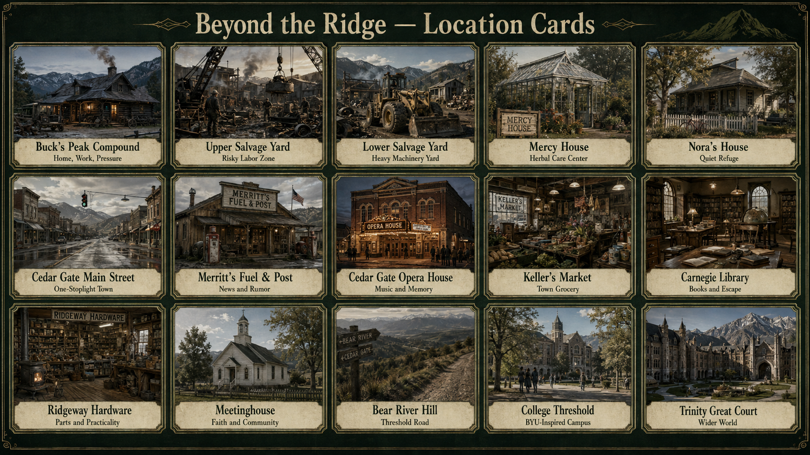

# Beyond the Ridge

**A grounded, third-person narrative game concept about work, family, belief, memory, loss, and the cost of choosing a wider world.**



> [!IMPORTANT]
> **Beyond the Ridge** is a provisional title for a classroom design exercise.
> The project draws thematic and environmental inspiration from Tara Westover's memoir *Educated*.
> It is not an authorized adaptation.

## Genesis: from literary assignment to playable world

The project began as a high-school literary design assignment about *Educated*.

The first goal was not to replay Tara Westover's life chapter by chapter.

The design question was harder: how could the memoir's world become a compelling game for teenagers?

Early discussion compared the desired experience with grounded narrative games such as *Red Dead Redemption* and *Life Is Strange*.

*Red Dead Redemption* suggested physical work, exploration, landscape, travel, and a world that feels larger than the player.

*Life Is Strange* suggested intimate relationships, conversation, consequence, memory, and choices that can remain emotionally unresolved.

The project rejected cartoon styling, a direct chapter reenactment, and a story concerned only with reaching college.

Instead, it kept recognizable literary DNA while creating an original playable world.

The early design retained the mountain, homestead, scrapyard, rural town, theater, religious life, dangerous work, education, and contested memory.

It transformed family figures into original characters with strengths, blind spots, fears, desires, worldviews, and gameplay functions.

It also treated religion as part of character worldview and community life rather than a morality score.

Characters do not wait in fixed locations to distribute quests.

They can approach Mara while she repairs equipment, prepares remedies, drives, studies, rehearses, or explores.

Each encounter should offer more than one reasonable action.

The result can change practical safety, access, trust, respect, fear, loyalty, dependence, or clarity.

The project also chose design before code.

The World Bible, Character Bible, Art Bible, storyboards, keyframes, and animatic plans must prove the experience before engine production begins.

As the design gained detail, the memoir became a reference for smaller forms of authenticity.

These details include speech rhythms, family jokes, forms of address, food, work habits, roads, stores, theaters, campus spaces, and remembered objects.

The game transforms these details into fictional equivalents when direct use would become imitation or create a rights concern.

This approach keeps the project recognizably informed by *Educated* without turning it into a book report with buttons.

The design later added credible defeat, persistent loss, and the Persistence System.

Selected losing endings can leave a hidden Redemption Window.

A previously foreshadowed person, object, place, record, capability, or act of grace can open a Second Road.

The original loss remains canon.

The player must notice what survived, accept a recovery cost, and build another path inside the changed world.

### Original design questions

These questions shaped the project and remain useful design tests:

- Would a teenager who never read *Educated* still want to keep playing?
- What does the player do from moment to moment besides select dialogue?
- How can family pressure become gameplay rather than a sequence of cutscenes?
- How can work reveal character, danger, competence, loyalty, and conflict at the same time?
- How can belief shape perception without becoming a good-versus-bad religion meter?
- How can each character's strengths and blind spots create different opportunities for the player?
- How can conversations begin naturally while the player works, travels, studies, or explores?
- How can a recognizable setting remain connected to the memoir without reenacting Tara's biography?
- How can conflicting memories become an interactive system instead of an exposition device?
- What must a visual prototype prove before the project writes gameplay code?
- How can the player truly lose without making safety or accessibility the wrong choice?
- How can hope survive a losing ending without erasing its consequence?

## Project summary

The player controls Mara Vale, a teenager raised inside a remote mountain family economy near the turn of the millennium.

Mara repairs machines, gathers remedies, travels mountain routes, works in town, studies unfamiliar ideas, and interprets conflicting accounts.

Each practical task changes a human situation. A fast repair can earn approval and increase danger.

A request for help can protect someone and expose a family secret.

A mistake can destroy equipment, close a route, injure Mara, harm another person, or harden a false public account.

Selected losses can contain a hidden Second Road, but no Second Road restores the original state for free.

The project uses one central question:

> How far will you go to learn what lies beyond the world you were given?

The Persistence System adds a second question:

> What can you still choose after the road you wanted is gone?

## Player experience

The game combines grounded action with social interpretation.

The player can:

- Repair, salvage, fabricate, haul, rig, and inspect machines.
- Cross mountain routes by foot, horse, and vehicle.
- Manage grip, balance, fatigue, traction, weather, and physical risk.
- Gather herbs and make care decisions with incomplete information.
- Listen, observe, ask, challenge, deflect, remain silent, or leave.
- Compare physical evidence, testimony, records, rumors, and memory.
- Trespass, hide, surrender, flee, or accept legal consequences.
- Return home and face consequences at breakfast, supper, and family work.
- Suffer persistent injury, asset loss, missed opportunities, and relationship loss.
- Develop mechanical skill, fieldcraft, observation, persuasion, history, self-direction, and collaboration.
- Discover selected Redemption Windows and build Second Roads after major loss.

The game has no morality bar.

Relationships track trust, respect, fear, loyalty, dependence, and clarity as separate states.

## Design principles

1. **Work is gameplay.** Skills grow through meaningful labor.
2. **Relationships are systems.** Each relationship can hold several conflicting states.
3. **Worldviews shape perception.** Beliefs affect what a character notices, praises, fears, or denies.
4. **Home is the consequence hub.** Choices return to the family table.
5. **Every solution has a cost.** The interface does not promise a perfect outcome.
6. **Curiosity opens the map.** Questions, trust, maps, and capability reveal new places.
7. **Loss is real.** Injury, death, failed opportunities, and damaged records can persist.
8. **Persistence is not an undo.** A Second Road preserves the loss and offers another form of agency.
9. **Safety remains playable.** Leaving, calling for help, de-escalating, and using accessibility options do not close the story.

## Current project state

The public repository contains design documentation, source traceability, package indexes, and selected small canonical artifacts.

Large editable decks and review exports remain external until the project configures an approved large-file path.

The repository does not contain a playable engine build.

| Area | Design state | Repository path |
|---|---|---|
| World design | Defined | `packages/foundation/01-world-bible/` |
| Character design | Defined | `packages/foundation/02-character-bible/` |
| Art direction | Defined | `packages/foundation/03-art-bible/` |
| Chapter adaptation | Mapped | `packages/playable-vision/adaptation-matrix/` |
| Gameplay systems | Defined | `packages/playable-vision/gameplay-systems/` |
| Opening slice | Storyboarded | `packages/playable-vision/opening-storyboard/` |
| Dialogue and memory | Defined | `packages/fidelity/dialogue-voice-memory/` |
| Locations and routes | Defined | `packages/fidelity/location-route-memory/` |
| Action and loss | Defined | `docs/design/ACTION_AND_LOSS_SYSTEMS.md` |
| Persistence System | Defined | `packages/persistence/` |
| Trailer and animatic | Planned | `packages/previsualization/` |
| Engine prototype | Not started | See `ROADMAP.md` |

See [STATUS.md](STATUS.md) for scope limits and evidence.

## Review paths

### Ten-minute review

1. Read this page.
2. Open the [project documentation](docs/README.md).
3. View the [location cards](assets/previews/world-overview.png).
4. View the [character cards](assets/previews/character-cards.png).
5. View the [systems overview](assets/previews/systems-overview.png).
6. View the [encounter cards](assets/previews/encounter-cards.png).
7. View the [worldview cards](assets/previews/worldview-cards.png).
8. View the [relationship-state cards](assets/previews/relationship-state-cards.png).
9. View the [gameplay keyframes](assets/previews/storyboard-overview.png).
10. Read the [Persistence System Bible](docs/design/REDEMPTION_WINDOWS_AND_SECOND_ROADS_BIBLE.md).

### Design review

1. Read the [design index](docs/design/README.md).
2. Review the World Bible, Character Bible, and Art Bible indexes.
3. Review the Gameplay Systems index.
4. Review the opening vertical-slice index.
5. Review Action and Loss Systems.
6. Review Redemption Windows and Second Roads.
7. Record a durable design conflict in an architecture decision record.

### Source-fidelity review

1. Read the [source and fidelity guide](docs/fidelity/README.md).
2. Review the chapter adaptation matrix.
3. Check the source register before adding a named place, memory, or form of address.
4. Apply the transformation guardrails in `RIGHTS_AND_USE.md`.

### Production review

1. Read the [production index](docs/production/README.md).
2. Review the cuebook and animatic package index.
3. Confirm character, location, prop, interface, and sound continuity.
4. Test each sequence against the vertical-slice success criteria.
5. Test loss-state frames for hazard readability and attributable failure.
6. Test Redemption Windows for causality, accessibility, and persistence integrity.

## Repository map

```text
.
├── assets/                 Public navigation graphics and approved project visuals
├── docs/                   Design guides, decisions, glossary, and traceability
├── packages/               Canonical package indexes and approved repository artifacts
├── source/                 Concise source records and implementation contracts
├── .github/                Contribution templates and documentation checks
├── AGENTS.md               Rules for development agents and writing agents
├── CONTRIBUTING.md         Change process and review requirements
├── GOVERNANCE.md           Decision ownership and approval boundaries
├── RIGHTS_AND_USE.md       Adaptation, attribution, and content-use limits
├── ROADMAP.md              Ordered project work
└── STATUS.md               Capability and evidence status
```

## Source relationship

The project borrows thematic and environmental material from *Educated*.

Recognizable anchors include the mountain, family labor, salvage work, herbal care, religious interpretation, performance, education, and contested memory.

Names, mission plots, player choices, character biographies, dialogue, game outcomes, loss systems, and Redemption Windows are original project material unless a source note states otherwise.

The source register uses four labels:

- **Direct fact:** A specific detail found in the memoir.
- **Composite influence:** Several passages inform one fictional element.
- **Original transformation:** The game changes source material into a new mechanic, place, or scene.
- **Restricted material:** The repository records a citation but does not store the protected source.

See [Source and fidelity](docs/fidelity/README.md) for the working method.

## Rights and content care

This repository is public.

It excludes the uploaded memoir, page scans, publisher art, long quotations, and other protected source copies.

Use private approved storage for restricted research material and unreleased source copies.

Do not convert trauma into a reward loop, collectible, spectacle, or boss fight.

Do not treat rural people or religious people as visual shorthand for ignorance or danger.

Do not require Mara to restore an abusive relationship to unlock a Second Road.

See [RIGHTS_AND_USE.md](RIGHTS_AND_USE.md) for the full boundary.

## Documentation standard

Repository prose follows the `write-timeless-technical-prose` skill from `hwillGIT/library-of-context`.

The documentation uses American English, active voice, stable terms, short sentences, and defined project vocabulary.

The documentation avoids edit history, promotional claims, vague quality claims, and unsupported comparisons.

The project does not claim formal ASD-STE100 compliance.

Human review must confirm approved terms and intended meaning.

See [Writing standard](docs/WRITING_STANDARD.md) for the local rules and source links.

## Contribution entry point

Read [CONTRIBUTING.md](CONTRIBUTING.md) before you change a canonical artifact.

Use a focused branch. Open a draft pull request early.

Link each change to a source, design principle, test, or decision record.

## Project ownership

Hubert Williams directs the concept and repository scope.

The project uses separate reviews for design, source fidelity, accessibility, faith representation, content care, loss fairness, persistence integrity, and rights.
